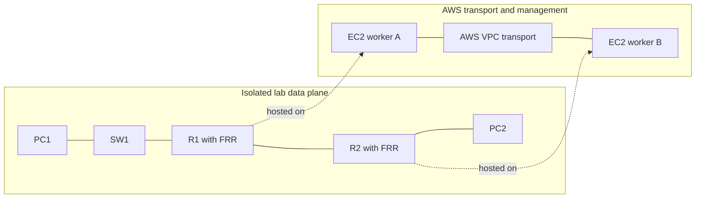

# Real network to AWS: behavioral translation specification

Version: 2.2.0 | Reviewed: 2026-09-19 | Status: target specification

This specification defines behavior to preserve in a cloud/Ansible plan and
implement in a separate generator. The active RAG consumes prepared architecture
JSON, checks readiness, and returns a JSON plan only for ready inputs. Discussion
is upstream, while
artifact generation and live checks are downstream. See the
[JSON contract](JSON_CONTRACT.md) and [implementation status](IMPLEMENTATION_GAPS.md). The [RAG guide](RAG_KNOWLEDGE_GUIDE.md) explains how the
retrieval documents are derived and consumed.

## 1. Objective and scope

Reproduce the forwarding behavior of the network described by the user on AWS.
PC1 must reach PC2 only when the supplied topology, addresses, interfaces, routes,
and filtering permit both the request and the reply. A missing route is a valid
lab condition; creating an AWS shortcut to hide it is a translation error.

The initial behavioral profile covers Ethernet LANs, VLAN membership, IPv4,
connected routes, static routes, RIPv2, single-area OSPFv2, ICMP, and explicit
filtering. Multi-area OSPF, route redistribution, VRFs, IPv6, STP variants,
vendor-specific features, and physical timing require separately validated
capabilities. Preserve their intent in the input and report unsupported features;
never silently approximate them as an ordinary fully connected network.

The target is observable protocol and forwarding behavior, not identical physical
latency, throughput, hardware failure domains, vendor CLI, or electrical links.
Running Linux FRRouting does not imply complete Cisco, Juniper, or VyOS parity.

### The behavioral contract

| Property | Required preservation |
| --- | --- |
| Connectivity | Intended successful flows succeed after required convergence. |
| Isolation | Forbidden and disconnected flows remain unreachable. |
| Path | Traffic traverses the specified routers/firewalls; no transport bypass. |
| Locality | Same-LAN communication does not acquire a router dependency. |
| Routing | The configured protocol or static route determines the selected path. |
| Failure | Link/router changes affect the lab according to its actual alternatives. |
| Provenance | Every assumption, derived value, and changed behavior is reported. |

Rules use MUST for requirements and SHOULD for recommendations. Rule IDs in
`kb/` provide the machine retrieval representation of this contract.

## 2. Preserve user intent before choosing AWS resources

This section describes preparation in the calling application. The RAG's local
readiness gate checks identities, interface IPs and links before translation. It
does not ask these questions or silently complete configuration. See
[the readiness contract](READINESS.md) for exactly what is blocked.

Record each supplied value as explicit, derived from an explicit value, or an
assumption. Keep configuration presence separate from configuration content:

- `unspecified`: the user has not supplied the setting. Ask a focused question
  when it changes the outcome, or return `unknown`; do not invent routing.
- `configured`: the supplied setting is present, even if it is incorrect.
- `explicitly_absent`: the user deliberately disabled or omitted a feature.

“Use OSPF and choose the details” authorizes generating the missing OSPF details.
“Here is my OSPF configuration” requires preserving it and diagnosing errors.
“No routes; show whether it works” requires retaining the missing routes.
Automatic addressing does not also authorize static routes, NAT, or firewalls.

Use names such as `EdgeWest` as well as `R1`; device numbering has no networking
meaning. Bind addresses and protocols to interfaces, not merely to device names.

### Required intermediate representation

This is a proposed compiler contract, not the schema currently implemented in
`legacy/models.py`. A downstream renderer must reject unsupported fields rather than drop
them silently.

| Object | Required information |
| --- | --- |
| Translation | schema version, mode, requested features, capabilities, assumptions |
| Node | stable ID, host/switch/router/firewall role, runtime/image/version |
| Interface | ID, owner, IPv4 prefix, admin state, MTU, segment, VLAN role |
| Link | ID, exact endpoint interfaces, enabled state, optional impairment |
| Switch | ports, access VLANs, allowed trunk VLANs, forwarding/STP policy |
| Host | lab interfaces, gateways or specific routes, host filtering |
| Router | interfaces, forwarding state, routes, protocol settings, filtering |
| Static route | prefix, next hop, interface/VRF, preference, discard behavior |
| RIP | version, participating interfaces, passive state, filters, timers |
| OSPF | router ID, interface areas/types/costs, passive state, timers/auth |
| Firewall | ordered policy, direction, statefulness, placement, default action |
| Transport | worker ENIs/IPs, tunnel endpoints/IDs, AWS routes and permissions |
| Verification | flow, source interface, destination, expectation, evidence, timeout |

Maintain the source graph and transport graph separately. Resource placement
must not rewrite the source graph.

## 3. Reference architecture: an isolated lab over AWS transport

Use `behavioral_lab` as the default for this project's stated goal. AWS provides
compute and transport; the lab's network stacks determine lab packet forwarding.



The dotted relationships are placement, not additional lab links.

### 3.1 Baseline placement

Run each logical device in an isolated network namespace or container with its
own network namespace. Router processes also need isolated runtime files,
configuration and control sockets. A container with an isolated filesystem and
network namespace is one suitable implementation. A dedicated EC2 instance per
logical device is also possible, but its lab interfaces must remain isolated
from the instance's AWS management interface.

This is an engineering design choice, supported by Linux network namespace
isolation; it is not an AWS service that automatically reproduces a topology.
See [Linux network namespaces](https://man7.org/linux/man-pages/man7/network_namespaces.7.html).

### 3.2 Realize each link explicitly

- On one worker, an explicit point-to-point cable can be a veth pair.
- Across workers, a cable can be a dedicated Ethernet-over-UDP tunnel such as
  VXLAN, using explicit unicast remote endpoints and a unique lab/link identifier.
- Switches are explicit bridge instances with the declared ports and VLAN rules.
- Preserve each switch and cable when switch failure or port behavior matters.
  Do not flatten a chain of switches into one segment and claim identical failures.
- A router-to-host cable is its own segment. Two different router ports are not
  automatically a shared LAN.

With VXLAN, define the VNI, UDP port, endpoints, MAC learning/flooding behavior,
and MTU deliberately. Flooding of inner ARP and protocol multicast must reach the
correct remote endpoint(s) without relying on outer AWS multicast. For a cable
there are exactly two endpoints. Avoid unintended forwarding loops and validate
bridge multicast behavior. [Linux VXLAN](https://docs.kernel.org/networking/vxlan.html),
[ip-link tunnel controls](https://man7.org/linux/man-pages/man8/ip-link.8.html),
and [Linux bridge](https://docs.kernel.org/networking/bridge.html).

### 3.3 Prevent bypass

Use separate address pools for AWS transport and lab interfaces. Lab prefixes
must not be assigned to ordinary AWS workload interfaces as an alternate route.
Worker bridges used for lab links have no host-side lab gateway address unless
the source topology explicitly includes that gateway. The worker must not route,
proxy-ARP, or masquerade between lab segments as an accidental shortcut.

Lab hosts have no management default route usable for lab destinations. Container
default bridges, host networking, and automatic egress masquerading are disabled
for the lab data plane. Manage the worker separately and enter the intended node
namespace/container for tests. A successful ping to a worker IP is not a lab test.

Restrict outer tunnel traffic to the actual worker endpoints. AWS security groups
see encapsulated transport traffic; lab firewalls enforce the inner lab policies.
An underlay route to a tunnel endpoint must never depend on a route learned inside
that same tunnel. Preserve management access when a lab link is intentionally down.

### 3.4 AWS-native migration is a separate mode

`cloud_native` may represent hosts as ordinary EC2 instances and use subnets,
peering, or Transit Gateway to preserve an agreed connectivity policy. It cannot
claim router-path or RIP/OSPF equivalence merely because those resources exist.
Select it only when the user accepts its declared differences.

AWS route tables can direct traffic to appliances, but the placement, next-hop
rules and return path must be designed explicitly. A software router's learned
routes do not automatically update VPC route tables. A direct ENI backend needs
its own proven routing integration and must enforce instance interface limits.
See [AWS routing options](https://docs.aws.amazon.com/vpc/latest/userguide/route-table-options.html)
and [EC2 network limits](https://docs.aws.amazon.com/ec2/latest/instancetypes/gp.html#gp_network).

Do not choose peering because the diagram contains two routers, or a full-mesh
Transit Gateway because it contains three. Those are transport choices, not
statements about the user's allowed paths. Peering is non-transitive; TGW routing
depends on route tables and propagation. Neither discovers the lab topology.
[Peering](https://docs.aws.amazon.com/vpc/latest/peering/vpc-peering-basics.html),
[TGW](https://docs.aws.amazon.com/vpc/latest/tgw/how-transit-gateways-work.html).

## 4. Host, switch and addressing semantics

For ordinary IPv4 Ethernet hosts, same subnet and same active VLAN/L2 segment
permit direct address resolution and local delivery when filtering permits it.
An unrelated router does not need to run a routing protocol. Same switch name
alone is insufficient: ports in different VLANs are separated.

Hosts in different IP subnets normally require a gateway or suitable specific
route, even on the same switch. Conversely, assigning the same prefix to two
separate LANs does not make them one LAN. Preserve the separation and diagnose
the addressing conflict; do not bridge them to make the test pass. Explicit proxy
ARP, bridging, secondary addresses or host routes require separate modeling.
[Host routing requirements](https://www.rfc-editor.org/rfc/rfc1122).

Keep the user's lab prefixes and interface addresses. Allocate missing values
only when authorized, using one allocation inventory that detects overlaps,
duplicate addresses and capacity conflicts. If an intentionally invalid lab is
requested, record the conflict and expected failure rather than silently repair it.

AWS subnet constraints apply to transport subnets, not to private overlay links.
A lab `/30` does not have to become an AWS subnet. Ordinary AWS IPv4 subnets have
size and reserved-address constraints; validate those separately. Do not split a
source LAN merely to give some nodes management or internet access.
[AWS subnet sizing](https://docs.aws.amazon.com/vpc/latest/userguide/subnet-sizing.html).

## 5. Routing semantics

### 5.1 Connected and static routes

A router with two working, addressed interfaces normally has connected routes to
both attached networks. With forwarding enabled and correct host gateways, it
can route between those networks without static routes, RIP, or OSPF.

For a remote network, each forwarding node needs a selected usable route and a
reachable next hop. Include the reply path. A valid default route can provide
reachability; a route need not always name the destination subnet explicitly.
Apply longest-prefix selection and the configured implementation's route
preference. Do not assume every vendor's preference values are identical.

A static route can be configured but inactive or ineffective because its next
hop is unreachable, the interface is down, or a more specific route wins. Check
the forwarding table, not only the configuration file. [IPv4 router requirements](https://www.rfc-editor.org/rfc/rfc1812)
and [FRR static routing](https://docs.frrouting.org/en/latest/static.html).

### 5.2 RIPv2

Explicitly configure version 2, the participating lab interfaces, passive
behavior, advertised networks and any requested filters or authentication. Verify
that the expected updates are exchanged and remote prefixes are installed.
RIPv2 uses UDP 520; multicast updates use 224.0.0.9. Its finite hop limit must be
respected; metric 16 is unreachable. FRR supports explicit unicast neighbors when
appropriate. Do not describe RIP as establishing OSPF-style Full adjacencies.

Do not inject fallback static routes to make a RIP exercise pass. On the
reference Ethernet links, carry protocol traffic inside the lab. Allow the
declared convergence time before testing and inspect learned route provenance.
[RIPv2 standard](https://www.rfc-editor.org/rfc/rfc2453),
[FRR RIP configuration](https://docs.frrouting.org/en/latest/ripd.html).

### 5.3 OSPFv2

Configure stable unique router IDs, appropriate link network types, areas,
participating/passive interfaces, costs, and any specified timers or
authentication. Use passive LAN interfaces when they should advertise a network
without discovering neighbors. A user-specified mismatch must remain visible.

OSPF is IP protocol 89, not TCP/UDP port 89. Ordinary Ethernet neighbor discovery
uses link-local multicast. AWS peering/TGW unicast routing is not an Ethernet
router cable. AWS has a separate TGW multicast feature; it is not enabled by
ordinary attachments and is not the reference design's substitute for lab links.
[AWS TGW multicast](https://docs.aws.amazon.com/vpc/latest/tgw/tgw-multicast-overview.html).

For the baseline two-router point-to-point OSPF link, require a Full adjacency
and installed remote routes. On a broadcast segment, some DROther pairs remaining
2-Way is normal; validate adjacency expectations according to network type.
Do not require every router pair to be Full. No static fallback or automatic
protocol redistribution is allowed unless requested.
[FRR OSPF](https://docs.frrouting.org/en/latest/ospfd.html).

### 5.4 Convergence and failures

Distinguish link-down detection from protocol-neighbor timeout. Removing a link
in a chain with no alternate path must eventually remove end-to-end reachability.
With a valid alternate path, eventual recovery may be the correct outcome.
Declare protocol timers and test bounds; do not promise identical physical
convergence times. Test the actual path with routes and packet captures; a missing
traceroute hop by itself does not prove a bypass or a failed router.

## 6. Firewalls, management and internet access

Preserve firewall placement, rule order, direction, statefulness, default action,
and explicitly permitted protocols. Host filtering is separate from router
forwarding. A working route does not override a denied ICMP echo request/reply.
ICMP reachability does not establish that SSH, HTTP, or another service is allowed.

AWS security groups are stateful allow-rule controls. AWS network ACLs support
ordered allow/deny rules and are stateless. Neither is a universal translation
of a router ACL or an inline firewall. In `behavioral_lab`, enforce inner policy
at the modeled lab device, and document any backend semantic mismatch.
[Security groups](https://docs.aws.amazon.com/vpc/latest/userguide/vpc-security-groups.html),
[network ACLs](https://docs.aws.amazon.com/vpc/latest/userguide/vpc-network-acls.html).

Management reachability does not make a PC public in the source network. Use a
separate management path. When a bastion is part of the requested design,
restrict target SSH to that path and verify that other sources cannot connect.
Adding one restrictive security group does not cancel broader allow rules.

Internet access is an explicit topology/policy feature. Model an egress edge,
forward and return routing, and NAT if required. Distinguish lab NAT from any
outer AWS NAT used for worker provisioning. For the documented zonal AWS public
NAT gateway pattern, provision a suitable public subnet and IGW even if all
workload hosts are private. Other AWS NAT forms need their own reviewed pattern.
Internet access must not give disconnected lab LANs a path to each other.

## 7. Worked configurations and expected outcomes

These are vendor-neutral examples with illustrative FRR routing stanzas. They
assume the declared interfaces/links have already been realized, forwarding is
enabled on routers, addressing is unique, and relevant traffic is permitted.
Stanzas must be validated against a pinned FRR version before automation; this
document is not an executed deployment transcript.

### 7.1 Two PCs on the same switch

`PC1 -- SW1 -- PC2`, with `SW1 -- R1 -- R2` as an additional branch.

| Interface | Address | Segment |
| --- | --- | --- |
| PC1:eth0 | 10.10.10.10/24 | SW1, VLAN 10 |
| PC2:eth0 | 10.10.10.20/24 | SW1, VLAN 10 |
| R1:lan0 | 10.10.10.1/24 | SW1, VLAN 10 |

PC1 pings 10.10.10.20 directly. The request and reply traverse SW1, not R1/R2.
No default gateway is needed for this local test. Stopping R1 or R2 must not
break it; stopping the relevant SW1 port must. Putting PC2 in VLAN 20 without
inter-VLAN routing changes the expected result to failure.

### 7.2 Two routers and static routes

`PC1 -- R1 -- R2 -- PC2`

| Interface | Address | Gateway |
| --- | --- | --- |
| PC1:eth0 | 10.10.10.10/24 | 10.10.10.1 |
| R1:lan0 | 10.10.10.1/24 | — |
| R1:wan0 | 10.255.0.1/30 | — |
| R2:wan0 | 10.255.0.2/30 | — |
| R2:lan0 | 10.20.20.1/24 | — |
| PC2:eth0 | 10.20.20.20/24 | 10.20.20.1 |

R1:

```text
ip route 10.20.20.0/24 10.255.0.2
```

R2:

```text
ip route 10.10.10.0/24 10.255.0.1
```

Expected: PC1 to PC2 ping succeeds through R1 then R2, with the reply returning
through R2 then R1. Remove the R2 return route, with no other matching route:
the ping fails. Remove both remote routes with no dynamic/default alternatives:
the ping fails even though R1 and R2 can still ping their directly connected
10.255.0.x addresses. This is a successful reproduction of missing routing.

### 7.3 The same topology using RIPv2

Use the addresses from 7.2. Remove the remote static routes and any fallback.
Enable zebra/ripd in the pinned FRR runtime. On both routers:

```text
router rip
 version 2
 network lan0
 network wan0
 passive-interface default
 no passive-interface wan0
```

Expected: each router advertises its LAN over wan0, learns the remote LAN, and
installs a usable RIP route. Ping succeeds after convergence. Inspect received
updates and the selected routes. If updates are blocked and learned routes age
out, ping must fail without an alternate route. Do not mistake initial absence
or a temporarily stale route for steady-state protocol behavior.

### 7.4 The same topology using OSPFv2

Use the addresses from 7.2, with no remote static/RIP/default alternatives.
Enable zebra/ospfd and configure both wan0 interfaces as point-to-point:

```text
interface wan0
 ip ospf network point-to-point
```

R1:

```text
router ospf
 ospf router-id 1.1.1.1
 network 10.10.10.0/24 area 0.0.0.0
 network 10.255.0.0/30 area 0.0.0.0
 passive-interface lan0
```

R2:

```text
router ospf
 ospf router-id 2.2.2.2
 network 10.20.20.0/24 area 0.0.0.0
 network 10.255.0.0/30 area 0.0.0.0
 passive-interface lan0
```

Expected: wan0 neighbors become Full, both remote LAN routes are installed, and
ping succeeds. Starting with different areas on the two ends prevents the
required adjacency and remote reachability. A change to an already converged
configuration must be tested after state has settled. Validate both the routing
table and kernel forwarding table; do not infer success from a running daemon.

### 7.5 A router can route connected networks without a routing protocol

`PC1 -- R1 -- PC2`, with PC1 and PC2 in different subnets directly attached to R1.
With addressed/up interfaces, forwarding, valid host gateways and permissive
filtering, ping succeeds using R1's connected routes. This prevents the false
rule that every inter-subnet ping needs static routes or a dynamic protocol.

## 8. Verification contract

This contract belongs to downstream deployment and verification tooling. The RAG
describes configuration intentions and never reports these checks as completed.

Keep three separate results:

- `predicted`: reasoning from the complete supplied configuration.
- `observed`: measurements from the deployed lab, or `not_run`.
- `conformance`: whether observations match the expected behavior.

A deliberately disconnected lab can have `predicted=fail`, `observed=fail`, and
`conformance=pass`. Never describe it as a successful ping. Conversely, an
unexpectedly successful ping is a failure of isolation or translation.

For every probe record source node/interface/IP, destination lab IP, protocol,
packet size/count, expected result and reason, expected/forbidden transit nodes,
convergence condition/deadline, and evidence. Use `unknown` for incomplete
configuration and `unsupported` for an unavailable required capability.

Verify in this order:

1. Source graph, interface addressing, VLAN membership and capability validation.
2. Worker readiness and tunnel/virtual-link health without changing lab routes.
3. Node interface state, host gateways, router forwarding and firewall policies.
4. Protocol readiness and selected forward/return routes.
5. Lab-originated ICMP and requested application probes, including negative cases.
6. Packet captures/counters at required routers to establish traversal.
7. Declared fault injection, route withdrawal/recovery, and restored baseline.

Distinguish a wrong management target, a missing utility and an unhealthy worker
from the expected lab routing failure. Terraform validation proves neither a
working protocol nor correct ping behavior. FRR installation/configuration errors
must fail their stage; suppressing them with `|| true` cannot establish readiness.

## 9. Delivery and implementation boundaries

Terraform provisions AWS transport, management and compute. Configuration
automation realizes the lab links, isolated nodes, interfaces, protocols and
filters from one validated model. Verification consumes that same model and
retains measured evidence. Do not infer networks from a public IP or hardcode
device names such as R1 through R8.

Pin OS, FRR and tunnel implementation versions. Verify package availability and
private-worker provisioning access. For native appliance designs, evaluate
source/destination checks and actual ENI quotas; for encapsulated workers,
logical lab ports do not require one AWS ENI each. Evaluate MTU with protocol and
larger-packet probes. Choose capacity from the selected backend and workload.

The downstream generator's first conformance milestone is a small reference set: same LAN,
two-router missing routes, two-router static routes, RIPv2, and OSPFv2, each with
positive and negative checks. Generalize only after those cases preserve paths
and isolation.

## 10. Source register and maintenance

[sources.json](sources.json) records primary references, review date, and the
claims each reference supports. AWS/FRR behavior must be rechecked when changing
provider, OS or protocol versions. Engineering choices in this specification
are project requirements; citations do not certify an unimplemented backend.

The RAG corpus and [evaluation cases](../evaluations/rag_cases.jsonl) identify
rules by stable IDs. Update the specification, affected rule cards, cases and
corpus version together; rebuild the search index whenever corpus content changes.

## 11. Application services and automation planning

The source architecture can carry application services alongside routing. HTTP on
WEB1 and OSPF on R1/R2 must both appear in the plan, bound to those exact targets.
Preserve listeners, ports, implementation, enabled state, document roots, supplied
content and TLS secret references. Plan package/configuration/service dependencies
without generating playbooks or adding routes or public listeners. Application
availability depends on both the configured service and the preserved network.

Explicit Ansible operations retain task IDs, target IDs, parameters and dependency
references. When a source device runs in an isolated namespace or container,
operations must execute in that component runtime; access to its worker alone
is insufficient. Management endpoints and credentials remain symbolic references
for the generator to resolve. See `SVC-HTTP`, `SVC-HTTPS`, `AUTO-001` and `AUTO-002`.
